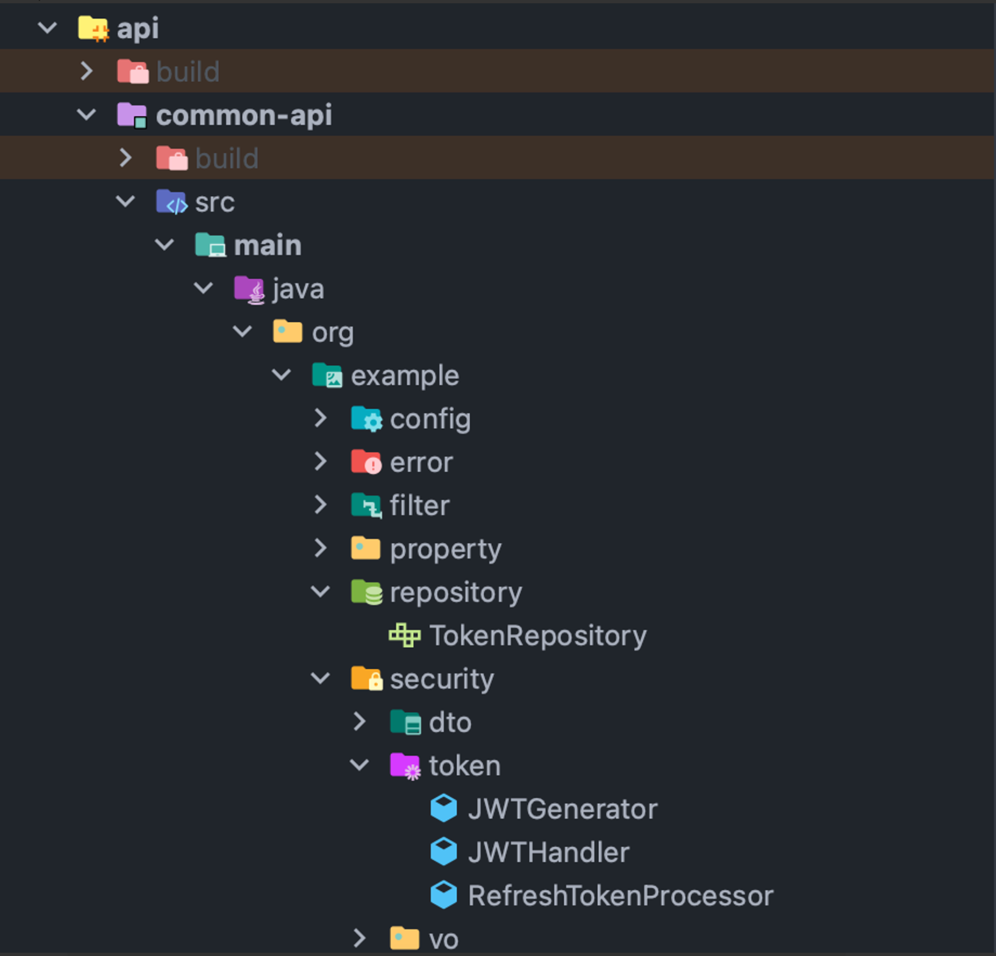
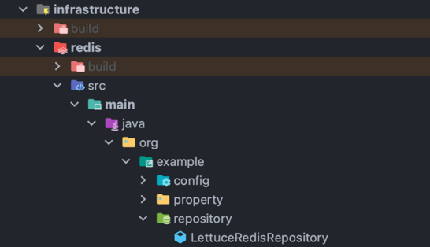
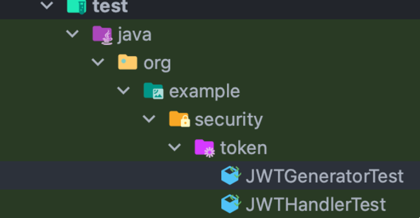
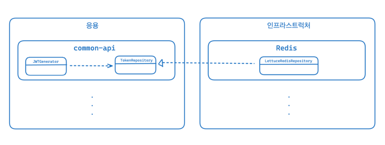

# 2. 아키텍쳐 개요

## 네 개의 영역

**표현 영역**

- HTTP 요청을 응용 영역이 필요로 하는 형식으로 변환해서 응용 영역에 전달하고 응용 영역의 응답을 HTTP 응답으로 변환하여 전송한다.

**응용 영역**

- 로직을 직접 수행하기보다는 도메인 모델에 로직 수행을 위임한다.

**도메인 영역**

- 도메인의 핵심 로직을 구현한다.

**인프라스터럭처 영역**

- 논리적인 개념을 표현하기보다는 실제 구현을 다룸
- ex) RDBMS 연동, 메시징 큐에 메시지를 처리, 몽고DB, 레디스와의 데이터 연동

## 계층 구조

- 계층 구조를 엄격하게 적용한다면 상위 계층은 바로 아래의 계층에만 의존을 가져야 하지만 구현의 편리함을 위해 계층 구조를 유연하게 적용하기도 한다.
- ex) 응용 계층은 도메인 계층에 의존하지만, 외부 시스템과의 연동을 위해 더 아래 계층인 인프라스트럭처 계층에 의존하기도 함
- 그러나 인프라스트럭처에 의존하면 **`테스트 어려움`**과 **`기능 확장의 어려움`** 문제가 발생함
    - 테스트 어려움 : 의존하고 있는 객체가 완벽하게 동작해야 함을 증명해야 한다.
    - 기능 확장의 어려움 : 의존하고 있는 객체가 변경되면 같이 변경해야 함

## DIP

- 고수준 모듈이 저수준 모듈을 사용했기에  **`테스트 어려움`**과 **`기능 확장의 어려움`** 문제가 발생함
- **해결 방법 : 인터페이스로 추상화를 한다.**
- **즉, 저수준 모듈이 고수준 모듈에 의존하게 하면 된다.(DIP)** 고수준 모듈은 더 이상 저수준 모듈에 의존하지 않고 구현을 추상화한 인터페이스에 의존한다.
- DIP를 항상 적용할 필요는 없고, 사용하는 구현 기술에 따라 완벽한 DIP를 적용하기보다는 구현 기술에 의존적인 코드를 도메인에 일부 포함하는게 효과적일 때도 있다.

## YAPP 프로젝트에서 적용 사례

### common-api 모듈


- common-api는 다른 api 모듈에서 사용할 수 있는 공통이 있는 api 모듈이다.
- 우리 팀은 common-api에 JWT, Spring Security 의존성을 추가하였고, 인증/인가 로직을 구현하였다.
- 이때 토큰을 저장할 용도로 Redis를 선택하였는데, 저수준 모듈이 고수준 모듈을 의존하도록 하였다.

### TokenRepository

- common-api(고수준 모듈)이 사용할 인터페이스이다.

```java
@Component
public interface TokenRepository {

    void save(String userId, String refreshToken);

    Optional<String> getExistRefreshToken(String userId);

    Boolean existAccessToken(String userId);
}
```

### JWTGEnerator

- 토큰을 생성할 때 레디스에 저장을 한다.

```java
@Component
@RequiredArgsConstructor
public class JWTGenerator {

    private final TokenProperty tokenProperty;
    private final TokenRepository tokenRepository;

    public TokenParam generate(UserParam userParam, Date from) {
        TokenParam tokenParam = TokenParam.builder()
            .accessToken(createAccessToken(userParam, from))
            .refreshToken(createRefreshToken(userParam, from))
            .build();

        tokenRepository.save(userParam.userId().toString(), tokenParam.refreshToken());
        return tokenParam;
    }
```

### redis 모듈


### LettuceRedisRepository

- TokenRepository를 구현한 구현체이다.

```java
@Component
@RequiredArgsConstructor
public class LettuceRedisRepository implements TokenRepository {

    private final StringRedisTemplate stringRedisTemplate;

    @Override
    public void save(String userId, String refreshToken) {
        stringRedisTemplate.opsForValue().set("RT:" + userId, refreshToken, 14, TimeUnit.DAYS);
    }

    @Override
    public Optional<String> getExistRefreshToken(String userId) {
        return Optional.ofNullable(stringRedisTemplate.opsForValue().get("RT:" + userId));
    }

    @Override
    public Boolean existAccessToken(String userId) {
        return stringRedisTemplate.hasKey("AT:" + userId);
    }

}
```

### redis 모듈의 build.gradle

- 저수준 모듈이 고수준 모듈을 의존한다.

```java
bootJar.enabled = false
jar.enabled = true

dependencies {
    implementation project(":app:api:common-api")

    //redis
    implementation 'org.springframework.data:spring-data-redis'
    implementation 'io.lettuce:lettuce-core:6.3.0.RELEASE'
}

```

### common-api에서 JwtGenerator 테스트


- TokenRepository을 mock으로 사용하여 실제 구현 없이 테스트를 할 수 있다.

```java
@DisplayName("JWT 생성 테스트")
class JWTGeneratorTest {

    long hour = 3600000L;
    long twoWeeks = 1209600000L;

    TokenProperty tokenProperty = new TokenProperty(
        "wehfiuhewiuhfhweiuhfiuwehifueisdfsdfsdfdsfsduwhfiuw",
        hour,
        twoWeeks
    );
    TokenRepository tokenRepository = mock(TokenRepository.class);
    JWTGenerator tokenGenerator = new JWTGenerator(tokenProperty, tokenRepository);
    
    ...
    
    @Test
    @DisplayName("1시간 전에 생성된 AccessToken은 유효하지 않다.")
    void accessTokenInvalidBeforeHourAgo() {
   
    ...
    
    }
  }
```

### 구조



### 도메인 영역의 주요 구성요소

- **엔티티** : 고유의 식별자를 갖는 객체로 자신의 라이프 사이클을 갖음
    - ex) 주문, 회원, 상품과 같은 도메인이 고유한 개념을 표현
    - 도메인 모델의 데이터를 포함하며 해당 데이터와 관련된 기능을 함께 제공함
- **밸류** : 고유의 식별자를 갖지 않는 객체로 주로 개념적으로 하나의 값을 표현할 때 사용함
    - ex) : 배송지 주소를 표현하기 위한 주소나 구매 금액을 위한 금액와 같은 타입
- **애그리거트** : 연관된 엔티티와 밸류 객체를 개념적으로 하나로 묶은 것
    - 관련 객체를 하나로 묶은 군집이다.
    - 애그리거트를 사용하면 개별 객체가 아닌 관련 객체를 묶어서 객체 군집 단위로 모델을 바라볼 수 있다.
    - 루트 엔티티는 애그리거트에 속해 있는 엔티티와 밸류 객체를 이용해서 애그리거트가 구현해야 할 기능을 제공한다.
    - ex) : 주문과 관련된 Order 엔티티, OrderLine 밸류, Orderer 밸류 객체를 ‘주문’ 애그러트로 묶을 수 있다.
- **리포지토리** : 도메인 모델의 영속성을 처리한다.
    - 도메인 객체를 보관해야 한다.
    - 애그리거트 단위로 도메인 객체를 저장하고 조회하는 기능을 정의한다.
    - ex) DBMS 테이블에서 엔티티 객체를 로딩하거나 저장하는 기능을 제공한다.
- **도메인** **서비스** : 특정 엔티티에 속하지 않은 도메인 로직을 제공한다.
    - ex) ‘할인 금액 계산’은 상품, 쿠폰, 회원 등급 ,구매 금액 등 다양한 조건을 이용해서 구현하게 됨 → 도메인 서비스에서 로직을 구현

### ❗도메인 모델의 엔티티와 DB 관계형 모델의 엔티티는 같은 것이 아님

- 도메인 모델의 엔티티는 단순히 데이터를 담고 있는 데이터 구조라기보다는 데이터와 함께 기능을 제공하는 객체
- 도메인 모델의 엔티티는 두 개 이상의 데이터가 개념적으로 하나인 경우 밸류 타입을 이용해서 표현할 수 있음