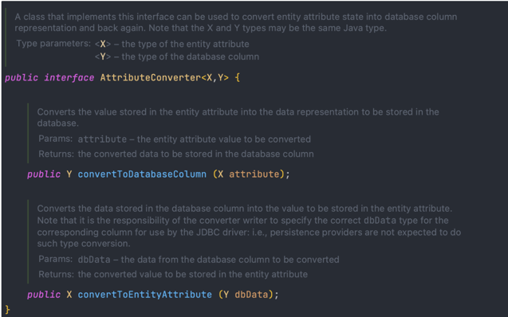
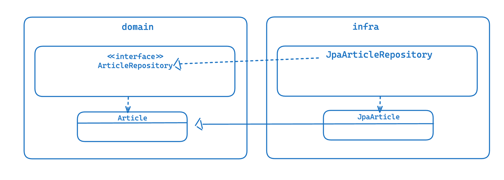

# 4. 리포지터리와 모델 구현
### JPA를 이용한 리포지터리 구현

**리포지터리 기본 기능**

- ID로 애그리거트 조회하기
- 애그리거트 저장하기

### 스프링 데이터 JPA를 이용한 리포지터리 구현

**스프링 데이터 JPA**

- 지정한 규칙에 맞게 리포지터리 인터페이스를 정의하면 리포지터리를 구현한 객체를 알아서 만들어 스프링 빈으로 등록해줌
- 리포지터리 인터페이스를 직접 구현하지 않아도 됨

### 매핑 구현

**엔티티와 밸류 기본 매핑 구현**

- 애그리거트 루트는 엔티티이므로 @Entity로 매핑 설정한다.
- 밸류는 @Embeddable로 매핑 설정한다.
- 밸류 타입 프로퍼티는 @Embedded로 매핑 설정한다.

**기본 생성자**

- JPA에서 @Entity, @Embeddable로 클래스를 매핑하려면 기본 생성자를 제공해야 함
- DB에서 데이터를 읽어와 매핑된 객체를 생성할 때 기본 생성자를 사용해서 객체를 생성하기 때문

**필드 접근 방식 사용**

- @Access(AccessType.PROPERTY)
- set 메서드는 내부 데이터를 외부에서 변경할 수 있는 수단이 되기 때문에 캡슐화를 깨는 원인이 될 수 있다.
- 엔티티가 객체로서 제 역할을 하려면 외부에 set 메서드 대신 의도가 잘 드러나는 기능을 제공해야 한다.
    - 상태 변경을 위한 setState() → 주문 취소를 위한 cancel() 메서드가 더 도메인을 잘 표현
    - setShippingInfo() 메서드 보대 배송지를 변경한다는 의미를 갖는 changeShippingInfo()가 도메인을 더 잘 표현함

**AttributeConverter를 이용한 밸류 매핑 처리**

```sql
public class Length {
	private int value;
	private String unit;
}

//DB에 100mm로 저장
WIDTH VARCHAR(20)
```

- AttributeConverter는 밸류 타입과 칼럼 데이터 간의 변환을 처리하기 위한 기능을 정의하고 있다.


```sql
@Converter(autoApply = true)
public class MoneyConverter implements AttributeConverter<Money, Integer> {

	@Override
	public Integer convertToDatabaseColumn(Money money) {
		return money == null ? null : money.getValue();
	}
	
	@Override
	public Integer convertToEntittyAttribute(Integer value) {
		return value == null ? null : new Money(value);
	}
	
```

- @Converter의 autoApply 속성을 false로 하면 프로퍼티 값을 반환할 때 사용할 컨버터를 직접 지정해야 한다.

**밸류 컬렉션**

**@ElementCollection**

- 연관된 부모 Entity 하나에만 연관되어 관리됩니다. (부모 Entity와 독립적으로 사용이 불가능합니다.)
- 항상 부모와 함께 저장되고 삭제되므로 cascade 옵션은 제공하지 않습니다. (cascade = ALL인 셈)
- 부모 Entity Id와 추가 칼럼(basic or embedded 타입)으로 구성됩니다.
- 기본적으로 식별자 개념이 없으므로 컬렉션 값 변경 시, 전체 삭제 후 새로 추가합니다.

**@OneToMany**

- 다른 Entity에 의해 관리될 수도 있습니다.
- Join table이나 칼럼은 보통 ID만으로 연관을 맺습니다.

**밸류를 이용한 ID 매핑**

- 식별자라는 의미를 부각시키기 위해 식별자 자체를 밸류 타입으로 만들 수도 있다.
- 밸류 타입으로 식별자르 구현할 때 얻을 수 있는 장점
    - 식별자에 기능을 추가할 수 있다.

```sql
@Embeddable
public class OrderNo implements Serializable {
	@Column(name="order_number")
	private String number;
	
	public boolean is2ndGeneration() {
		return number.startsWith("N")'
	}
}

// 1세대 시스템의 주문번호와 2세대 시스템의 주문번호를 구분할 떄 주문번호의 첫 글자를 이용할 경우
// 시스템 세대를 구분할 수 있는 기능을 구현할 수 있다.
```

**별도 테이블에 저장하는 밸류 매핑**

- 애그리거트에 속한 객체가 밸류인지 엔티티인지 구분하는 방법은 고유 식별자를 갖는지를 확인하는 것이다.
- 밸류를 매핑하기 위해 @SecondaryTable과 @AttributeOverride를 사용한다.

**밸류 컬렉션을 @Entity로 매핑하기**

- 개념젹으로 밸류인데 구현 기술의 한계나 팀 표준에 따라 @Entity를 사용해야 할 때도 있음
- ex) 제품의 이미지 업로드 방식에 따라 이미지 경로와 섬네일 이미지 제공 여부가 달라짐
    - @Inheritance 애너테이션 적용
    - strategy 값으로 SINGLE_TABLE 사용
    - @DiscriminatorColumn 애너테이션을 이용하여 타입 구분용으로 사용할 칼럼 지정

**ID 참조와 조인 테이블을 이용한 단방향 M-N 매핑**

```sql
@Entity
@Table(name = "product")
public class Product {
	@EmbeddedId
	private ProductId id;
	
	@ElementCollection
	@CollectionTable(name = "product_category", 
			joinColumns = @JoinColumn(name = "product_id"))
	private Set<CategoryId> categoryIds;
```

- 집합의 값에 밸류 대신 연관을 맺는 식별자가 오므로 단방향 M-N 연관을 ID 참조 방식으로 구현한 것
- ElemetCollection을 이용하기 때문에 Product를 삭제할 때 매핑에 사용된 조인 테이블의 데이터도 함께 삭제됨
- 애그리거트를 직접 참조하는 방식을 사용했다면 영속성 전파나 로딩 전략을  고민해야 하는데 ID 참조 방식을 사용함으로써 이런 고민을 없앨 수 있음

### **애그리거트의 영속성 전파**

- 저장 메서드는 애그리거트 뤁트만 저장되면 안 되고 애그리거트에 속한 모든 객체를 저장해야 한다.
- 삭제 메서드는 애그리거트 루트 뿐만 아니라 애그리거트에 속한 모든 객체를 삭제해야 한다.

### **식별자 생성 기능**

- 사용자 직접 생성
- 도메인 로직으로 생성
- DB를 이용한 일련번호 사용

> 식별자 생성 규칙이 있다면 엔티티를 생성할 때 식벼라를 엔티티가 별도 서비스로 식별자 생성 기능을 분리해야 한다.
>
- 식별자 생성 규칙은 도메인 규칙이므로 도메인 영역에 식별자 생성 기능을 위치시켜야 한다.

```sql
public class ProductIdService {
	public ProductId nextId() {
		... // 식별자 생성
	}
}

public class CreateProductService {
	@Autowired private ProductIdService idService;
	@Autowired private ProductRepository productRepository;
	
	@Transactional
	public ProductId createProdcut(ProductCreationCommand cmd) {
		ProductId id = idService.nextId();
		Product product = new Product(id, cmd.getDetail(), cmd.getPrice(), ...);
		productRepository.save(product);
		return id;
}
```

- 특정 값의 조합으로 식별자를 생성되는 것 역시 규칙이므로 도메인 서비스를 이요해서 식별자를 생성할 수 있다.

```sql
public class OrderIdService {
	public OrderId createId(UserId userId) {
		if (userId == null) throw new IllegalArgumentException("invalid userid: " + userId);
		return new OrderId(userId.toString + "-" + timestamp());
	}
	...
}
```

- 식별자 생성 규칙을 구현하기에 적합한 또 다른 장소는 리포지터리다.

```sql
public interface ProductRepository {
	.. 
	// 식별자를 생성하는 메서드
	ProductId nextId();
}
// 리포지터리 구현 클래스에서 알맞게 구현하면 됨
```

- DB 자동 증가 칼럼을 식별자로 사용하면 식별자 매핑에서 @GeneratedValue를 사용함

```sql
@Entity
@Table(name = "article")
public class Article {
	@Id
	@GeneratedValue(strategy = GenerationType.IDENTITY) 
	private Long id;
	
	public Long getId() {
		return id;
	}
}
// 자동 증가 칼럼은 DB의 insert 쿼리를 실행해야 식별자가 생성되므로 도메인 객체를 리포지터리에 저장할 때 식별자가 생성된다.
-> 도메인 객체를 저장한 뒤에 식별자를 구할 수 있다.
```

### **도메인 구현과 DIP**

- 구현 긱술에 대한 의존 없이 도메인을 순수하게 유지하려면 스프링 데이터의 JPA의 Repository인터페이스를 상속받지 않도록 수정하고 구현한 클래스를 인프라에 위치시켜야한다.
- 또한 @Entity, @Table과 같이 JPA에 특화된 애너테이션을 모두 지우고 인프라에 JPA를 연동하기 위한 클래스를 추가해아한다.


→ 이 같은 구조는 구현 기술을 변경하더라도 도메인이 받는 영향을 최소화할 수 있다.

DIP를 적용하는 주된 이유는 저수준 구현이 변경되더라도 고수준이 영향을 받지 않도록 하기 위함이다.

하지만 리포지터리와 도메인 모델의 구현 기술은 거의 바뀌지 않음 → DIP를 완벽하게 지키면 좋겠지만 개발 편의성과 실용성을 가져가면서 구조적인 유연함은 어느정도 유지됨

→ 타협을 적절히 히는것도 합리적인 선택임