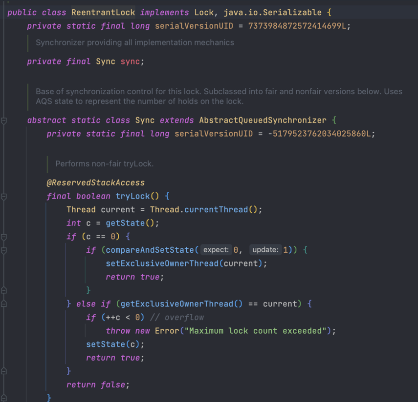

# 8. 애그리거트 트랜잭션 관리

### 8.1 애그리거트와 트랜잭션

- 트랜잭션 처리 방식

1. 선점 방식 (비관적 락) 2. 비선점 방식 (낙관적 락)

### 8.2 선점 잠금

- 한 트랜잭션에서 쓰기를 하는 동안 다른 트랜잭션에서는 잠금으로 대기
- JPA에서는 EntityManager는 LockModeType을 인자로 받는 find()메서드르 제공함

```java
entityManger.find(Order.class,LockModeType.PESSIMISTIC_WRITE)
```

- for update 쿼리를 이용해서 선점 잠금을 구현한다.

```java
@Lock(LockModeType.PESSIMISTIC_WRITE)
```

- 스프링 데이터 JPA는 @Lock 애너테이션을 사용해서 잠금 모드를 지정한다.

**교착상태**

- 선점 잠금에서 교착생태가 발생할 수 있음
- 스레드 1, 2에서 각각 자원을 선점한 상태에서 서로 상대가 가진 자원에 대해 선점 잠금을 시도할 경우 발생함
- 해결 방법
    1. 잠금을 구할 때 최대 대기 시간을 지정해야 함
    2. 각 잠금 순서를 일치시켜주면 데드락이 발생하지 않음

```java
// JPA 해결 방법
Map<String, Object> hints=new HashMap();
    hits.put("javax.peristence.lock.timeout",2000);
    Order order=entityManager.find(Order.class,LockModeType.PESSIMISTIC_WRITE)
```

- DBMS에 따라 힌트가 적용되지 않을 수가 있다.

```java
//스프링 데이터 JPA는 @QueryHints 애너테이션을 사용해서 쿼리 힌트를 작성할 수 있다.
@Lock(LockModeType.PESSIMISTIC_WRITE)
@QueryHints({
    @QueryHint(name = "javax.peristence.lock.timeout", 2000)
}
)
@Query("selet m from Member m where m.id = :id)
    Optional<Member>findByIdForUpdate(@Param("id) MemberId memberId)
```

### 비선점 잠금

- 동시에 접근하는 것을 막는 대신 변경한 데이터를 실제 DBMS에 반영하는 시점에 변경 가능 여부를 확인하는 방식이다.

```java
UPDATE aggtable SET version=version+1,colx=?,coly=?
    WHERE aggid=?and version=현재 버전
```

- JPA는 버전을 이용한 비선점 잠금 기능을 지원한다. @Version 애너테이션을 붙이고 매핑되는 테이블에 버전을 저장할 칼럼을 추가하면 된다.

```java
public class Order {

    @Version
    private long version;
	
	...
}
```

- 비선점 잠금 충돌 발생시 스프링 프레임워크에서 OptimisticLockingFailureException이 발생함

**강제 버전 증가**

- 루트 애그리거트의 값이 바뀌지 않았더라다도 애그리거트의 구성요소 중 일부 값이 바뀌면 논리적으로 그 애그리거트는 바뀐 것이다.
- 따라서 애그리거트 내의 어떤 구성요소의 상태가 바뀌면 루트 애그리거트이 버전 값이 증가해야 비선점 잠금이 올바르게 동작한다.
- JPA의 경우 LockModeType.OPTIMISTIC_FORCE_INCREMENT를 사용하면 해당 엔티티의 상태가 변경되엇는지에 상관엇이 트랜잭션 종료 시점에 버전 값 증가
  처리를 한다.
- 스프링 데이터 JPA에서는 @Lock 애너테이션을 이용해서 지정하면 된다.

### 오프라인 선점 잠금

- 잠금 선점 시도, 잠금 확인, 잠금 해제, 잠금 유효시간 연장의 네 가지 기능이 필요하다
